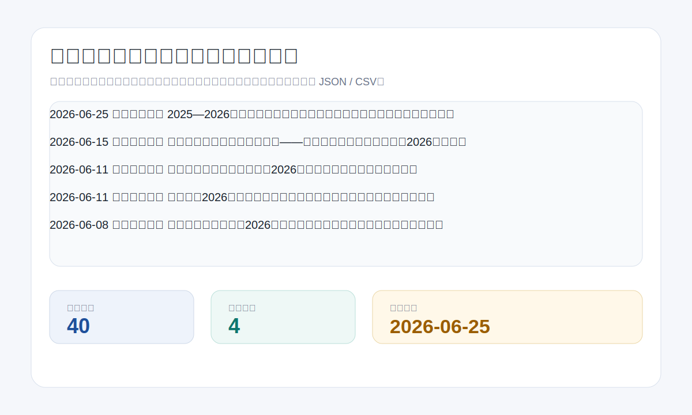

# 中国政法大学证据科学研究院通知公告观察站

[English README](README.md)

这是一个非官方的中国政法大学证据科学研究院公开通知公告归档项目。它每天抓取研究院网站的首页通知、人才培养通知、新闻资讯和科研新闻等栏目，保存历史数据，并生成一个可以直接打开的静态公告看板。



## 项目用途

证据科学研究院的博士预答辩、开放课题、研究生培养、学术论坛和科研新闻等信息经常需要持续关注。本项目把公开网页中的公告整理成结构化数据，方便检索、导出、归档和后续做跨站点聚合。

## 目标站点

- 站点：中国政法大学证据科学研究院
- 主页：`https://zjkxyjy.cupl.edu.cn/`
- 通知公告：`https://zjkxyjy.cupl.edu.cn/zh/index/notice.htm`
- 同步栏目：首页通知公告、人才培养通知公告、首页新闻资讯、科学研究新闻资讯

本项目不是中国政法大学官方项目，不代表学校或研究院发布信息。请以官方网页为准。

## 快速开始

```bash
python3 scraper.py 2
python3 -m http.server 8000
```

然后打开 `http://localhost:8000` 查看前端看板。

## 数据结构

每条公告包含：`id`、`title`、`date`、`url`、`summary`、`section`、`source_url`、`first_seen_at`、`last_seen_at`。

生成文件：

- `data/notices.json`：合并后的历史公告
- `data/notices.csv`：CSV 导出文件
- `data/history/YYYY-MM-DD.json`：当天抓取快照
- `data/meta.json`：站点、更新时间、总数、栏目等元数据

重复运行会按公告 URL 合并数据，不会重复插入同一条公告，也不会覆盖已有历史。

## 定时更新

仓库包含 `.github/workflows/update.yml`。GitHub Actions 每天定时运行：

```yaml
on:
  schedule:
    - cron: "20 23 * * *"
```

工作流会执行 `python3 scraper.py 2`，并把变化后的 `data/` 文件提交回仓库。该流程使用 GitHub 默认的 `GITHUB_TOKEN`，不需要额外密钥。

## 前端看板

前端由 `index.html`、`styles.css`、`app.js` 组成，直接读取 `data/notices.json` 和 `data/meta.json`，提供公告总量、最新日期、栏目数量统计、关键词搜索、栏目筛选、JSON / CSV 下载入口和响应式界面。

## 图示与申报材料

- 架构图：`assets/architecture.svg`
- Demo 图：`assets/demo.svg`
- 前端截图：`assets/frontend-desktop.png`、`assets/frontend-mobile.png`
- 项目申报书：`docs/project_proposal.docx`

申报书包含项目背景、目标用户、技术路线、数据结构、合规说明、应用价值和后续扩展方向。

## 合规说明

- 只抓取公开网页信息。
- 不绕过登录、权限控制或非公开接口。
- 不采集个人隐私数据。
- 仅用于学习、归档、检索和公开数据展示。
- 涉及培养、学位、课题、论坛等事项时，请以中国政法大学证据科学研究院官方网站发布内容为准。

## 路线图

- 继续扩展到更多中国政法大学学院和处室网站。
- 做一个总看板，聚合每日创建的各站点公告仓库。
- 增加 RSS / Atom 订阅输出。
- 记录公告标题变化、撤稿和链接失效等事件。

## License

MIT
